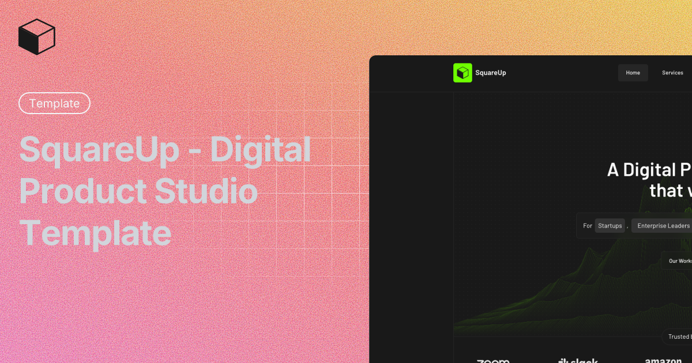

# SquareUp - Digital Product Studio Template



A modern, responsive Next.js template for digital product studios, agencies, and creative businesses. Built with TypeScript, Tailwind CSS, and Next.js 16.

## ✨ Features

- 🎨 **Modern Design** - Clean, professional UI with smooth animations
- 📱 **Fully Responsive** - Optimized for all devices and screen sizes
- ⚡ **Fast Performance** - Built with Next.js 16 for optimal speed
- 🎯 **Complete Sections** - Hero, Services, Clients, Testimonials, FAQ, and Contact
- 🛠️ **Type-Safe** - Full TypeScript support
- 🎭 **Customizable** - Easy to modify colors, content, and styling
- 🔧 **Developer Friendly** - Clean code structure with Biome for linting

## 🚀 Getting Started

### Prerequisites

- Node.js 18+ or Bun
- npm, yarn, pnpm, or bun

### Installation

1. Clone the repository:

```bash
git clone <your-repo-url>
cd squareup
```

2. Install dependencies:

```bash
npm install
# or
bun install
```

3. Run the development server:

```bash
npm run dev
# or
bun dev
```

4. Open [http://localhost:3000](http://localhost:3000) in your browser

## 🏗️ Project Structure

```
squareup/
├── app/                 # Next.js app directory
├── components/
│   ├── sections/       # Page sections (Hero, Services, etc.)
│   ├── shared/         # Shared components (Navbar, Footer)
│   └── ui/             # Reusable UI components
├── lib/                # Utility functions
└── public/             # Static assets
```

## 🛠️ Tech Stack

- **Framework:** Next.js 16
- **Language:** TypeScript
- **Styling:** Tailwind CSS 4
- **Icons:** Tabler Icons
- **Linting:** Biome
- **Package Manager:** Bun (or npm/yarn/pnpm)

## 📝 Available Scripts

- `npm run dev` - Start development server
- `npm run build` - Build for production
- `npm run start` - Start production server
- `npm run lint` - Run Biome linter
- `npm run format` - Format code with Biome

## 🎨 Customization

1. **Colors:** Modify the color scheme in `app/globals.css`
2. **Content:** Update text and images in component files
3. **Sections:** Add or remove sections in `components/views/home-view.tsx`
4. **Logo:** Replace `public/logo.svg` with your own logo

## 🙏 Credits

- **Design:** [@praha](https://x.com/Praha37v)
- **Development:** [@ditinagrawal](https://x.com/ditinagrawal)

---

Made with ❤️ for digital product studios
